# Database Schema — Meridian Capital v1

**Companion to**: [PRD.md](PRD.md) · [PRODUCT-BRIEF.md](PRODUCT-BRIEF.md)
**Target**: PostgreSQL 15+ (PRD §6 stack default), accessed from the Node app via Prisma ORM (§6). All DDL below is runnable as-is, in order.
**Status**: Draft for review — no migration tooling implied yet. DDL + guarantees verified against Postgres 15 by [db-schema-checks.sql](db-schema-checks.sql).

---

## 1. Design decisions (read first)

1. **The brokerage feed is the source of truth; trade cards are claims against it.** `broker_fills` stores raw SnapTrade account activity append-only (with the full payload for replay). `trade_cards` are the trader's published claims — except for the SIP fund, where the monthly `sip_plans` row is the claim, so DCA fills verify against the plan instead of demanding trade cards (and stops) for index buys. `reconciliations` joins the two — a card is never "verified" by a flag on itself but by a reconciliation row pointing at a real fill. Omissions (fills with no card) are first-class rows, not exceptions (PRD 1.3/1.4).
2. **Append-only where trust lives — enforced by the database, not comments.** Published trade cards are immutable; all changes (stop moved, partial exit, close) are rows in `trade_card_events` (PRD 2.3). Transcripts, fills, and card events refuse UPDATE/DELETE via triggers in the DDL below — they're the attorney's evidence pack and the no-cherry-picking guarantee. (`agent_runs` rows do receive their running→ok/error completion update; the append-only promise is on the trust tables.)
3. **The database enforces the publisher lane where it can.** A `CHECK` constraint makes it impossible to publish a card without stop + exit rules (PRD 2.2). There is deliberately **no user risk-profile table** (PRD 5.1: session-only inputs) and **no per-user feed customization** (PRD 9.2) — the schema's shape is itself a compliance argument.
4. **Market data is not stored.** Prices, fundamentals, and charts come live from the market-data MCP (brief non-goal: don't rebuild TradingView). The only persisted market data is what charts and audits need daily: fund NAV and benchmark closes. AI outputs (key-facts, news relevance) are cached because they cost money to regenerate, not because they're the record.
5. **Single trader, three funds.** No multi-tenant structure — `funds` is a 3-row table. Revisit at v2, not before (brief §11 key-person risk is accepted).
6. **Stripe owns billing state; we mirror it.** `subscriptions` is a webhook-maintained mirror; `stripe_webhook_events` gives idempotent processing. Never write business logic against Stripe API responses directly.

## 2. Entity-relationship diagram

Rendered copy: [db-erd.svg](db-erd.svg). Edges are actual foreign keys — tables with no FK in either direction (`feed_syncs`, `benchmark_prices`, `stripe_webhook_events`, `agent_runs`*) appear unconnected by design.

```mermaid
erDiagram
    funds {
        smallint id PK
        enum code UK "alpha | sip | swing"
        text name
        text benchmark_symbol
        date inception_date
    }
    instruments {
        bigint id PK
        text symbol UK
        text name
        text asset_type
    }
    sizing_methodologies {
        bigint id PK
        smallint fund_id FK
        int version
        text body_md
        jsonb params
        timestamptz published_at
    }
    trade_cards {
        uuid id PK
        smallint fund_id FK
        bigint instrument_id FK
        enum direction "long | short"
        numeric entry_price
        numeric position_pct
        text thesis_md
        numeric stop_price "NOT NULL if published"
        text exit_rules_md "NOT NULL if published"
        enum status "draft | published | closed"
        timestamptz published_at
    }
    trade_card_events {
        bigint id PK
        uuid trade_card_id FK
        text event_type "stop_moved | partial_exit | closed | note"
        jsonb payload
        text note_md "nullable"
        timestamptz created_at
    }
    broker_fills {
        uuid id PK
        text snaptrade_txn_id UK
        bigint instrument_id FK "nullable"
        text raw_symbol "nullable for cash-only rows"
        text activity_type "trade | dividend | interest | transfer | split | fee | other"
        text side "buy | sell — trades only"
        numeric quantity
        numeric price
        numeric amount "signed cash effect"
        numeric fees
        timestamptz executed_at
        jsonb raw
    }
    reconciliations {
        bigint id PK
        text kind "entry | exit"
        text status "matched | mismatched | unmatched_fill | unmatched_card"
        uuid trade_card_id FK "nullable"
        bigint trade_card_event_id FK "nullable"
        bigint sip_plan_id FK "nullable"
        uuid broker_fill_id FK "nullable, unique"
        jsonb details
        timestamptz resolved_at
    }
    feed_syncs {
        bigint id PK
        text trigger "schedule | on_demand | webhook"
        text status "running | ok | error"
        int fills_ingested
    }
    fund_nav_daily {
        smallint fund_id PK,FK
        date date PK
        numeric nav
        numeric invested
        numeric cash
    }
    fund_cash_flows {
        bigint id PK
        smallint fund_id FK
        date date
        numeric amount "+ deposit | - withdrawal"
        uuid broker_fill_id FK "nullable, unique"
    }
    benchmark_prices {
        text symbol PK
        date date PK
        numeric close
    }
    sip_plans {
        bigint id PK
        smallint fund_id FK
        date month UK
        text plan_md
        jsonb breakdown
    }
    drawdown_comms {
        bigint id PK
        smallint fund_id FK
        jsonb trigger_metrics
        text draft_md
        text status "draft | approved | sent | discarded"
    }
    ai_key_facts_cache {
        bigint instrument_id PK,FK
        text content_md
        text model
        timestamptz generated_at
    }
    news_items {
        bigint id PK
        bigint instrument_id FK
        text external_id UK
        text headline
        text relevance "high | med | low"
        timestamptz published_at
    }
    users {
        uuid id PK
        text email UK
        text auth_provider UK "with auth_subject"
        text auth_subject UK
        text role "subscriber | trader"
    }
    disclosure_versions {
        int id PK
        text body_md
        timestamptz effective_at
    }
    disclosure_acceptances {
        uuid user_id PK,FK
        int disclosure_version_id PK,FK
        timestamptz accepted_at
    }
    subscriptions {
        uuid id PK
        uuid user_id FK,UK
        text stripe_customer_id UK
        text stripe_subscription_id UK
        text status
        timestamptz current_period_end
    }
    stripe_webhook_events {
        text stripe_event_id PK
        text event_type
        jsonb payload
        timestamptz processed_at
    }
    assistant_sessions {
        uuid id PK
        uuid user_id FK
        smallint fund_id FK "nullable"
        uuid trade_card_id FK "nullable"
        timestamptz started_at
    }
    assistant_messages {
        bigint id PK
        uuid session_id FK
        text role "user | assistant"
        text content
        text question_type
        bool refused
        text skill_invoked
        jsonb skill_inputs
        bigint methodology_id FK "nullable"
    }
    alert_preferences {
        uuid user_id PK,FK
        smallint fund_id PK,FK
        bool trade_alerts
        bool news_alerts
        text channel "email | push"
    }
    notifications {
        bigint id PK
        uuid user_id FK
        text kind "trade | news | drawdown | digest | statement"
        jsonb ref
        text channel
        timestamptz sent_at
    }
    agent_runs {
        bigint id PK
        text agent
        text trigger "schedule | source_event | manual_feedback"
        text status "running | ok | error"
        jsonb summary
    }
    agent_feedback {
        bigint id PK
        text agent
        uuid user_id FK
        text feedback
        jsonb adjustment
    }
    statements {
        bigint id PK
        smallint fund_id FK
        date period_month
        text pdf_path
    }

    funds ||--o{ sizing_methodologies : "versions"
    funds ||--o{ trade_cards : "publishes"
    funds ||--o{ fund_nav_daily : "equity curve"
    funds ||--o{ fund_cash_flows : "deposits / withdrawals"
    funds ||--o{ sip_plans : ""
    funds ||--o{ drawdown_comms : ""
    funds ||--o{ statements : ""
    funds ||--o{ alert_preferences : ""
    funds |o--o{ assistant_sessions : "context"
    instruments ||--o{ trade_cards : ""
    instruments |o--o{ broker_fills : ""
    instruments ||--o{ news_items : ""
    instruments ||--o| ai_key_facts_cache : ""
    trade_cards ||--o{ trade_card_events : "timeline"
    trade_cards |o--o{ reconciliations : "entry verified by"
    trade_card_events |o--o{ reconciliations : "close verified by"
    broker_fills |o--o| reconciliations : "matches"
    sip_plans |o--o{ reconciliations : "SIP fills verified by"
    broker_fills |o--o| fund_cash_flows : "transfer source"
    trade_cards |o--o{ assistant_sessions : "context"
    sizing_methodologies |o--o{ assistant_messages : "formula version"
    users ||--o| subscriptions : ""
    users ||--o{ disclosure_acceptances : ""
    disclosure_versions ||--o{ disclosure_acceptances : ""
    users ||--o{ assistant_sessions : ""
    assistant_sessions ||--o{ assistant_messages : ""
    users ||--o{ alert_preferences : ""
    users ||--o{ notifications : ""
    users ||--o{ agent_feedback : "trader"
```

<sub>*`agent_runs.agent`/`agent_feedback.agent` reference agents by name (a shared `agent_name` enum), not FK — agents are code, not rows.</sub>



## 3. DDL

### 3.1 Reference & funds (Epics 1–3)

```sql
CREATE TYPE fund_code AS ENUM ('alpha', 'sip', 'swing');
CREATE TYPE trade_direction AS ENUM ('long', 'short');  -- 'short' unreachable on Robinhood today; kept because PRD 2.1 specifies the field
CREATE TYPE card_status AS ENUM ('draft', 'published', 'closed');

CREATE TABLE funds (
  id               smallint PRIMARY KEY,
  code             fund_code UNIQUE NOT NULL,
  name             text NOT NULL,                  -- "$1M Alpha Fund"
  description      text NOT NULL,
  badge            text NOT NULL,                  -- "Long-term investing"
  benchmark_symbol text NOT NULL DEFAULT 'SPY',
  inception_date   date NOT NULL
);

CREATE TABLE instruments (
  id         bigint GENERATED ALWAYS AS IDENTITY PRIMARY KEY,
  symbol     text UNIQUE NOT NULL,                 -- "NVDA"
  name       text NOT NULL,
  asset_type text NOT NULL DEFAULT 'equity'
             CHECK (asset_type IN ('equity', 'etf'))
);

-- Published sizing formulas per fund (PRD 5.2). Versioned: transcripts and
-- eval cases must be able to reference the exact formula in force at the time.
CREATE TABLE sizing_methodologies (
  id           bigint GENERATED ALWAYS AS IDENTITY PRIMARY KEY,
  fund_id      smallint NOT NULL REFERENCES funds(id),
  version      int NOT NULL,
  body_md      text NOT NULL,        -- human-readable published methodology
  params       jsonb NOT NULL,       -- machine-usable: {"risk_pct_min":1,"risk_pct_max":2,...}
  published_at timestamptz NOT NULL DEFAULT now(),
  UNIQUE (fund_id, version)
);
```

### 3.2 Trade cards & timeline (Epic 2)

```sql
CREATE TABLE trade_cards (
  id            uuid PRIMARY KEY DEFAULT gen_random_uuid(),
  fund_id       smallint NOT NULL REFERENCES funds(id),
  instrument_id bigint NOT NULL REFERENCES instruments(id),
  direction     trade_direction NOT NULL,
  entry_price   numeric(18,4) NOT NULL CHECK (entry_price > 0),
  position_pct  numeric(6,3) NOT NULL CHECK (position_pct > 0 AND position_pct <= 100),
  thesis_md     text NOT NULL,
  stop_price    numeric(18,4),
  exit_rules_md text,
  status        card_status NOT NULL DEFAULT 'draft',
  published_at  timestamptz,
  created_at    timestamptz NOT NULL DEFAULT now(),
  -- PRD 2.2: publishing is blocked without stop + exit rules. No exceptions,
  -- and not only in the UI — the database refuses.
  CONSTRAINT published_requires_exits CHECK (
    status = 'draft'
    OR (stop_price IS NOT NULL AND exit_rules_md IS NOT NULL AND published_at IS NOT NULL)
  )
);

CREATE INDEX ON trade_cards (fund_id, published_at DESC) WHERE status <> 'draft';

-- PRD 2.3: after publish, the ONLY legal change is published -> closed with
-- every other column frozen, and published cards are never deleted. Enforced
-- here, not just in the app — the immutability claim is DDL, not discipline.
CREATE FUNCTION trade_cards_guard() RETURNS trigger LANGUAGE plpgsql AS $$
BEGIN
  IF OLD.status = 'draft' THEN
    RETURN COALESCE(NEW, OLD);       -- drafts are freely editable and deletable
  END IF;
  IF TG_OP = 'DELETE' THEN
    RAISE EXCEPTION 'published trade cards are never deleted';
  END IF;
  IF NOT (OLD.status = 'published' AND NEW.status = 'closed'
          AND (NEW.fund_id, NEW.instrument_id, NEW.direction, NEW.entry_price,
               NEW.position_pct, NEW.thesis_md, NEW.stop_price, NEW.exit_rules_md,
               NEW.published_at, NEW.created_at)
              IS NOT DISTINCT FROM
              (OLD.fund_id, OLD.instrument_id, OLD.direction, OLD.entry_price,
               OLD.position_pct, OLD.thesis_md, OLD.stop_price, OLD.exit_rules_md,
               OLD.published_at, OLD.created_at)) THEN
    RAISE EXCEPTION 'published trade cards are immutable — append a trade_card_event instead';
  END IF;
  RETURN NEW;
END $$;

CREATE TRIGGER trade_cards_immutable
  BEFORE UPDATE OR DELETE ON trade_cards
  FOR EACH ROW EXECUTE FUNCTION trade_cards_guard();

-- Shared guard for the append-only trust tables (design decision #2).
CREATE FUNCTION forbid_change() RETURNS trigger LANGUAGE plpgsql AS $$
BEGIN
  RAISE EXCEPTION '% is append-only', TG_TABLE_NAME;
END $$;

-- Everything that happens after entry is an append-only event.
CREATE TABLE trade_card_events (
  id            bigint GENERATED ALWAYS AS IDENTITY PRIMARY KEY,
  trade_card_id uuid NOT NULL REFERENCES trade_cards(id),
  event_type    text NOT NULL CHECK (event_type IN ('stop_moved', 'partial_exit', 'closed', 'note')),
  payload       jsonb NOT NULL DEFAULT '{}',  -- {"new_stop":..} / {"exit_price":..,"qty_pct":..}
  note_md       text,
  created_at    timestamptz NOT NULL DEFAULT now()
);

CREATE INDEX ON trade_card_events (trade_card_id, created_at);

CREATE TRIGGER trade_card_events_append_only
  BEFORE UPDATE OR DELETE ON trade_card_events
  FOR EACH ROW EXECUTE FUNCTION forbid_change();
```

### 3.3 Brokerage feed & reconciliation (Epic 1 — the trust engine)

```sql
-- Raw SnapTrade account activity. Append-only; `raw` keeps the full payload so
-- the whole pipeline is replayable if mapping logic changes. Not just trades:
-- dividends, interest, transfers, and splits land here too — NAV needs the cash
-- rows, and split rows let reconciliation adjust pre-split entry prices instead
-- of flagging false mismatches. `fees` (regulatory SEC/TAF on sells; Robinhood
-- charges no commission) feeds the net-of-fees requirement (PRD 9.3).
CREATE TABLE broker_fills (
  id               uuid PRIMARY KEY DEFAULT gen_random_uuid(),
  snaptrade_txn_id text UNIQUE NOT NULL,          -- idempotent ingest
  instrument_id    bigint REFERENCES instruments(id),
  raw_symbol       text,                          -- as reported, even if unmapped; null on cash-only rows
  activity_type    text NOT NULL DEFAULT 'trade' CHECK (activity_type IN
                     ('trade', 'dividend', 'interest', 'transfer', 'split', 'fee', 'other')),
  side             text CHECK (side IN ('buy', 'sell')),
  quantity         numeric(18,6),
  price            numeric(18,4),
  amount           numeric(18,2),                 -- signed cash effect (dividends, transfers, fees)
  fees             numeric(18,2) NOT NULL DEFAULT 0,
  executed_at      timestamptz NOT NULL,
  raw              jsonb NOT NULL,
  synced_at        timestamptz NOT NULL DEFAULT now(),
  -- a trade row carries its trade fields; other activity kinds may not
  CONSTRAINT trade_fields CHECK (
    activity_type <> 'trade'
    OR (side IS NOT NULL AND quantity IS NOT NULL AND price IS NOT NULL AND raw_symbol IS NOT NULL)
  )
);

CREATE INDEX ON broker_fills (executed_at DESC);

-- instrument_id is the one mutable column: late raw_symbol -> instrument
-- mapping is allowed; everything else is frozen at ingest.
CREATE TRIGGER broker_fills_append_only
  BEFORE DELETE OR UPDATE OF snaptrade_txn_id, raw_symbol, activity_type, side,
    quantity, price, amount, fees, executed_at, raw, synced_at
  ON broker_fills
  FOR EACH ROW EXECUTE FUNCTION forbid_change();

-- Every sync attempt, success or failure — powers the "last verified at T"
-- staleness banner (PRD 1.6) and feed-health observability.
CREATE TABLE feed_syncs (
  id             bigint GENERATED ALWAYS AS IDENTITY PRIMARY KEY,
  trigger        text NOT NULL CHECK (trigger IN ('schedule', 'on_demand', 'webhook')),
  started_at     timestamptz NOT NULL DEFAULT now(),
  finished_at    timestamptz,
  status         text NOT NULL DEFAULT 'running'
                 CHECK (status IN ('running', 'ok', 'error')),
  fills_ingested int NOT NULL DEFAULT 0,
  error          text
);

-- The verification join (PRD 1.3/1.4). A card entry — or a close event, or a
-- SIP fill against the month's plan — is "✓ verified" iff a 'matched' row
-- exists pointing at a real fill.
-- 'unmatched_fill' rows ARE the omission flags: a fill nobody published.
CREATE TABLE reconciliations (
  id                  bigint GENERATED ALWAYS AS IDENTITY PRIMARY KEY,
  kind                text NOT NULL CHECK (kind IN ('entry', 'exit')),
  status              text NOT NULL CHECK (status IN
                        ('matched', 'mismatched', 'unmatched_fill', 'unmatched_card')),
  trade_card_id       uuid REFERENCES trade_cards(id),
  trade_card_event_id bigint REFERENCES trade_card_events(id),  -- closes verified too (PRD 2.3)
  sip_plan_id         bigint,                       -- SIP claims; FK added in §3.5 (sip_plans defined there)
  broker_fill_id      uuid REFERENCES broker_fills(id),
  details             jsonb NOT NULL DEFAULT '{}',  -- price/qty deltas on mismatch
  resolved_at         timestamptz,                  -- trader addressed the flag
  created_at          timestamptz NOT NULL DEFAULT now(),
  -- a fill can verify at most one thing
  CONSTRAINT one_match_per_fill UNIQUE (broker_fill_id),
  -- this table is the trust engine: each status has exactly one legal shape —
  -- no 'matched' stamp without a fill, no verification pointing at two claims
  CONSTRAINT status_shape CHECK (
    (status IN ('matched', 'mismatched') AND broker_fill_id IS NOT NULL
       AND num_nonnulls(trade_card_id, trade_card_event_id, sip_plan_id) = 1)
    OR (status = 'unmatched_fill' AND broker_fill_id IS NOT NULL
       AND num_nonnulls(trade_card_id, trade_card_event_id, sip_plan_id) = 0)
    OR (status = 'unmatched_card' AND broker_fill_id IS NULL
       AND num_nonnulls(trade_card_id, trade_card_event_id, sip_plan_id) = 1)
  ),
  -- entries verify cards or SIP plans; exits verify close/partial-exit events
  CONSTRAINT kind_matches_claim CHECK (
    status = 'unmatched_fill'
    OR (kind = 'entry' AND trade_card_event_id IS NULL)
    OR (kind = 'exit' AND trade_card_id IS NULL AND sip_plan_id IS NULL)
  )
);

CREATE INDEX ON reconciliations (status) WHERE resolved_at IS NULL;
```

### 3.4 Performance series (Epics 1, 3)

```sql
-- One row per fund per day — the equity curve. NAV computed by the sync agent
-- from fills + cash; benchmark stored alongside for the vs-S&P chart.
CREATE TABLE fund_nav_daily (
  fund_id  smallint NOT NULL REFERENCES funds(id),
  date     date NOT NULL,
  nav      numeric(18,2) NOT NULL,
  invested numeric(18,2) NOT NULL,
  cash     numeric(18,2) NOT NULL,
  PRIMARY KEY (fund_id, date)
);

CREATE TABLE benchmark_prices (
  symbol text NOT NULL,
  date   date NOT NULL,
  close  numeric(18,4) NOT NULL,
  PRIMARY KEY (symbol, date)
);

-- External cash flows (deposits/withdrawals), dated. Without these the equity
-- curve conflates deposits with gains — an "auditable, no cherry-picking"
-- record (PRD 1.2, 9.3) needs time-weighted returns: this table + fund_nav_daily.
CREATE TABLE fund_cash_flows (
  id             bigint GENERATED ALWAYS AS IDENTITY PRIMARY KEY,
  fund_id        smallint NOT NULL REFERENCES funds(id),
  date           date NOT NULL,
  amount         numeric(18,2) NOT NULL CHECK (amount <> 0),  -- + deposit, - withdrawal
  broker_fill_id uuid UNIQUE REFERENCES broker_fills(id),     -- source transfer row, when feed-derived
  created_at     timestamptz NOT NULL DEFAULT now()
);

-- Open positions: published CLAIMS, adjusted for partial exits, with the entry
-- verification stamp joined on (decision #1). The claim is what's displayed;
-- the stamp says whether the brokerage record agrees — a card the feed
-- contradicts surfaces as 'flagged', never silently.
CREATE VIEW current_positions AS
SELECT tc.fund_id,
       tc.instrument_id,
       tc.id AS trade_card_id,
       tc.direction,
       tc.entry_price,
       tc.position_pct * (1 - COALESCE(x.exited_pct, 0) / 100.0) AS position_pct,
       tc.published_at,
       COALESCE(v.stamp, 'pending') AS entry_verification
FROM trade_cards tc
LEFT JOIN LATERAL (
  SELECT sum((e.payload->>'qty_pct')::numeric) AS exited_pct
  FROM trade_card_events e
  WHERE e.trade_card_id = tc.id AND e.event_type = 'partial_exit'
) x ON true
LEFT JOIN LATERAL (
  -- verified iff every entry reconciliation matched (partial fills = many rows)
  SELECT CASE WHEN bool_and(r.status = 'matched') THEN 'verified' ELSE 'flagged' END AS stamp
  FROM reconciliations r
  WHERE r.trade_card_id = tc.id AND r.kind = 'entry'
) v ON true
WHERE tc.status = 'published';
```

### 3.5 SIP plans & drawdown comms (Epics 2–3)

```sql
-- Priya's monthly plan (PRD 3.4). For the SIP fund the published plan IS the
-- claim: DCA fills reconcile against the month's plan (reconciliations.sip_plan_id),
-- not against trade cards — so index buys don't trip the stop/exit-rules gate
-- (nonsense for buy-and-hold) and don't show up as omission flags (PRD 1.4).
CREATE TABLE sip_plans (
  id           bigint GENERATED ALWAYS AS IDENTITY PRIMARY KEY,
  fund_id      smallint NOT NULL REFERENCES funds(id),
  month        date NOT NULL,               -- first of month
  plan_md      text NOT NULL,
  breakdown    jsonb NOT NULL,              -- [{"symbol":"VOO","pct":60},...]
  published_at timestamptz,
  UNIQUE (fund_id, month)
);

-- FK for the column declared in §3.3 (sip_plans didn't exist yet there).
ALTER TABLE reconciliations
  ADD CONSTRAINT reconciliations_sip_plan_fk
  FOREIGN KEY (sip_plan_id) REFERENCES sip_plans(id);

-- PRD 2.4: AI drafts, trader approves, then it goes out. Status gates the flow.
CREATE TABLE drawdown_comms (
  id              bigint GENERATED ALWAYS AS IDENTITY PRIMARY KEY,
  fund_id         smallint NOT NULL REFERENCES funds(id),
  trigger_metrics jsonb NOT NULL,           -- {"drawdown_pct":-12.4,"window_days":30}
  draft_md        text NOT NULL,
  status          text NOT NULL DEFAULT 'draft'
                  CHECK (status IN ('draft', 'approved', 'sent', 'discarded')),
  approved_at     timestamptz,
  sent_at         timestamptz,
  created_at      timestamptz NOT NULL DEFAULT now()
);
```

### 3.6 AI caches (Epic 4)

```sql
-- key-facts Skill output (PRD 4.2). Cache, not record — regenerated on
-- material news; safe to truncate.
CREATE TABLE ai_key_facts_cache (
  instrument_id bigint PRIMARY KEY REFERENCES instruments(id),
  content_md    text NOT NULL,
  model         text NOT NULL,
  generated_at  timestamptz NOT NULL DEFAULT now()
);

-- News from the news MCP with the relevance-filter Skill's verdict attached
-- (PRD 4.3, 7.3).
CREATE TABLE news_items (
  id            bigint GENERATED ALWAYS AS IDENTITY PRIMARY KEY,
  instrument_id bigint NOT NULL REFERENCES instruments(id),
  external_id   text UNIQUE NOT NULL,        -- idempotent ingest
  headline      text NOT NULL,
  summary       text,
  url           text,
  published_at  timestamptz NOT NULL,
  relevance     text CHECK (relevance IN ('high', 'med', 'low')),  -- null = not yet ranked
  relevance_reason text,
  ranked_at     timestamptz
);

CREATE INDEX ON news_items (instrument_id, published_at DESC);
```

### 3.7 Users, subscriptions, disclosures (Epic 6, Epic 9)

```sql
CREATE TABLE users (
  id            uuid PRIMARY KEY DEFAULT gen_random_uuid(),
  email         text UNIQUE NOT NULL,
  auth_provider text NOT NULL,               -- 'email' | 'google' | ...
  auth_subject  text NOT NULL,               -- provider's stable user id
  role          text NOT NULL DEFAULT 'subscriber'
                CHECK (role IN ('subscriber', 'trader')),
  created_at    timestamptz NOT NULL DEFAULT now(),
  UNIQUE (auth_provider, auth_subject)
);
-- Deliberately absent: risk_tolerance, account_size, investment_goals.
-- PRD 5.1 — sizing inputs are session-only. Their absence here is a
-- compliance feature; do not add them without attorney sign-off.

-- Disclaimer text is versioned; acceptance binds a user to a specific version
-- at a specific time (PRD 6.3, 9.1) — that pair is the compliance record.
CREATE TABLE disclosure_versions (
  id           int GENERATED ALWAYS AS IDENTITY PRIMARY KEY,
  body_md      text NOT NULL,
  effective_at timestamptz NOT NULL DEFAULT now()
);

CREATE TABLE disclosure_acceptances (
  user_id               uuid NOT NULL REFERENCES users(id),
  disclosure_version_id int NOT NULL REFERENCES disclosure_versions(id),
  accepted_at           timestamptz NOT NULL DEFAULT now(),
  PRIMARY KEY (user_id, disclosure_version_id)
);

-- Mirror of Stripe state, maintained ONLY by webhook processing.
CREATE TABLE subscriptions (
  id                     uuid PRIMARY KEY DEFAULT gen_random_uuid(),
  user_id                uuid UNIQUE NOT NULL REFERENCES users(id),
  stripe_customer_id     text UNIQUE NOT NULL,
  stripe_subscription_id text UNIQUE NOT NULL,
  status                 text NOT NULL,       -- Stripe's vocabulary, verbatim
  current_period_end     timestamptz NOT NULL,
  canceled_at            timestamptz,
  updated_at             timestamptz NOT NULL DEFAULT now()
);

CREATE TABLE stripe_webhook_events (
  stripe_event_id text PRIMARY KEY,           -- idempotency key
  event_type      text NOT NULL,
  payload         jsonb NOT NULL,
  processed_at    timestamptz,
  error           text,
  received_at     timestamptz NOT NULL DEFAULT now()
);
```

### 3.8 Assistant transcripts (Epic 5 — the attorney's evidence pack)

```sql
CREATE TABLE assistant_sessions (
  id            uuid PRIMARY KEY DEFAULT gen_random_uuid(),
  user_id       uuid NOT NULL REFERENCES users(id),
  fund_id       smallint REFERENCES funds(id),        -- context, if opened from a fund
  trade_card_id uuid REFERENCES trade_cards(id),      -- context, if opened from a trade
  started_at    timestamptz NOT NULL DEFAULT now()
);

-- Append-only. This log IS PRD 5.5 — queryable by question type, exportable
-- for the attorney's publisher-lane review. Sizing inputs the user typed
-- (account size, risk band) appear in message content/skill_inputs as part of
-- the conversation record — that is logging, not profiling: nothing outside
-- this log stores them, nothing reads them back into a later session.
CREATE TABLE assistant_messages (
  id              bigint GENERATED ALWAYS AS IDENTITY PRIMARY KEY,
  session_id      uuid NOT NULL REFERENCES assistant_sessions(id),
  role            text NOT NULL CHECK (role IN ('user', 'assistant')),
  content         text NOT NULL,
  question_type   text,       -- tagged by classifier: 'sizing' | 'exit_now' | 'personal_advice' | ...
  refused         boolean NOT NULL DEFAULT false,
  skill_invoked   text,       -- 'copy-sizing' | 'key-facts' | 'relevance-filter'
  skill_inputs    jsonb,      -- session-only sizing inputs, preserved in the record
  methodology_id  bigint REFERENCES sizing_methodologies(id),  -- exact formula version applied
  created_at      timestamptz NOT NULL DEFAULT now()
);

CREATE INDEX ON assistant_messages (session_id, created_at);
CREATE INDEX ON assistant_messages (question_type) WHERE refused;

CREATE TRIGGER assistant_messages_append_only
  BEFORE UPDATE OR DELETE ON assistant_messages
  FOR EACH ROW EXECUTE FUNCTION forbid_change();
-- If the user-deletion question (§5) lands on redact-not-delete, this trigger
-- gains a narrow redaction path then — not before.
```

### 3.9 Alerts, notifications, agents (Epic 7)

```sql
CREATE TABLE alert_preferences (
  user_id      uuid NOT NULL REFERENCES users(id),
  fund_id      smallint NOT NULL REFERENCES funds(id),
  trade_alerts boolean NOT NULL DEFAULT true,
  news_alerts  boolean NOT NULL DEFAULT false,
  channel      text NOT NULL DEFAULT 'email' CHECK (channel IN ('email', 'push')),
  PRIMARY KEY (user_id, fund_id)
);

-- Everything sent to anyone. Digests and statement deliveries are kinds here —
-- no separate sent-log tables.
CREATE TABLE notifications (
  id      bigint GENERATED ALWAYS AS IDENTITY PRIMARY KEY,
  user_id uuid NOT NULL REFERENCES users(id),
  kind    text NOT NULL CHECK (kind IN ('trade', 'news', 'drawdown', 'digest', 'statement')),
  subject text NOT NULL,
  ref     jsonb NOT NULL DEFAULT '{}',   -- {"trade_card_id":..} / {"news_item_id":..,"symbol":..}
  channel text NOT NULL CHECK (channel IN ('email', 'push')),
  sent_at timestamptz NOT NULL DEFAULT now(),
  -- the dedup indexes below key on these ref fields; a missing key would
  -- silently opt a row out of dedup (NULLs never collide in a plain unique index)
  CONSTRAINT ref_has_dedup_key CHECK (
    (kind <> 'news' OR ref ? 'symbol')
    AND (kind <> 'trade' OR ref ? 'trade_card_id')
  )
);

-- PRD 7.3: max 1 news alert per ticker per user per day — enforced here,
-- not in application code. (timezone('UTC', ...) because a bare ::date cast
-- is session-timezone-dependent and Postgres rejects it in an index.)
CREATE UNIQUE INDEX one_news_alert_per_ticker_per_day
  ON notifications (user_id, (ref->>'symbol'), ((timezone('UTC', sent_at))::date))
  WHERE kind = 'news';

-- The P0 alert gets the same treatment: a retried send can't double-alert.
-- event_id is null for the initial publish alert (PG15 NULLS NOT DISTINCT).
CREATE UNIQUE INDEX one_trade_alert_per_event
  ON notifications (user_id, (ref->>'trade_card_id'), (ref->>'event_id'))
  NULLS NOT DISTINCT
  WHERE kind = 'trade';

-- Agents are code, not rows — one shared enum instead of drifting CHECK lists.
CREATE TYPE agent_name AS ENUM
  ('reconciliation', 'trade_alert', 'news_alert', 'drawdown_watch', 'statement_gen');

-- Bar #2 observability: every agent run, what triggered it, what it did.
CREATE TABLE agent_runs (
  id          bigint GENERATED ALWAYS AS IDENTITY PRIMARY KEY,
  agent       agent_name NOT NULL,
  trigger     text NOT NULL CHECK (trigger IN
                ('schedule', 'on_demand', 'source_event', 'manual_feedback')),  -- PRD 7.2 incl. on-demand refresh
  started_at  timestamptz NOT NULL DEFAULT now(),
  finished_at timestamptz,
  status      text NOT NULL DEFAULT 'running' CHECK (status IN ('running', 'ok', 'error')),
  summary     jsonb NOT NULL DEFAULT '{}'
);

-- PRD 7.4: trader feedback that re-plans agent behavior (thresholds etc.)
CREATE TABLE agent_feedback (
  id         bigint GENERATED ALWAYS AS IDENTITY PRIMARY KEY,
  agent      agent_name NOT NULL,
  user_id    uuid NOT NULL REFERENCES users(id),   -- trader
  feedback   text NOT NULL,
  adjustment jsonb,                                 -- what the agent changed in response
  created_at timestamptz NOT NULL DEFAULT now()
);
```

### 3.10 Statements (Epic 8)

```sql
CREATE TABLE statements (
  id           bigint GENERATED ALWAYS AS IDENTITY PRIMARY KEY,
  fund_id      smallint NOT NULL REFERENCES funds(id),
  period_month date NOT NULL,                -- first of month
  pdf_path     text NOT NULL,                -- object-storage key, not a blob
  generated_at timestamptz NOT NULL DEFAULT now(),
  UNIQUE (fund_id, period_month)
);
```

## 4. Deliberate omissions (schema-as-compliance)

| Not in the schema | Why |
|---|---|
| User risk profiles / stored sizing inputs | PRD 5.1 + non-goal 5: session-only. A stored profile is the first step out of the publisher lane. |
| Per-user feed/content tables | PRD 9.2: same impersonal feed to all. The schema cannot represent a personalized feed, so nobody can ship one by accident. |
| Subscriber brokerage links | Subscribers never connect accounts (no auto-copy — PRD non-goal 2). Only the trader's feed exists, and it isn't a `users` row concern. |
| Market prices / fundamentals / OHLC tables | Live via market-data MCP (brief: don't rebuild TradingView). Only `fund_nav_daily` + `benchmark_prices` persist, because charts and audits need history. |
| Multi-trader / tenancy columns | One trader is the v1 moat and the accepted risk. `funds` has 3 rows. |
| Soft-delete columns on trust tables | Fills, cards, events, transcripts are append-only. Deletion is the thing the product promises not to do. |

## 5. Open questions

| Question | Blocks |
|---|---|
| NAV computation: does SnapTrade report account equity directly (then `fund_nav_daily` is ingested), or do we compute from activity + cash + EOD prices? One Robinhood account maps to three funds how — sub-accounts, or tagging fills to funds at publish time? Same question for attributing a deposit to a fund in `fund_cash_flows`. | 3.4, and the fund_id on `broker_fills` question — currently fills carry no fund; the trade card claims the fund and reconciliation binds them. Confirm with the M1 SnapTrade spike. |
| Push notifications: v1 ships email-only? `channel='push'` is in the schema but token storage (`push_tokens` table) is deferred until push is real. | 3.9 |
| Transcript retention period (attorney may want a minimum, GDPR-ish hygiene may want a maximum) | 3.8 |
| User deletion vs. append-only transcripts: transcripts hold user-typed sizing inputs and are promised as the attorney's evidence pack, yet a subscriber's account-deletion request needs an answer — anonymize the `users` row? redact `content` while keeping `question_type`/`refused` stats? Attorney + privacy-hygiene call; the append-only trigger stays strict until decided. | 3.7, 3.8 |

## 6. Prisma (the Node app's ORM layer)

Prisma is the client, not the database — it runs **on** the Postgres above (`provider = "postgresql"`), which keeps the fullstack Node/Next.js codebase uniform without giving up any of the DDL. Do **not** hand-write `schema.prisma` from this doc; generate it when the app scaffold exists:

1. Copy the §3 DDL verbatim into the baseline migration `prisma/migrations/0_init/migration.sql`, apply it, and mark it applied: `prisma migrate resolve --applied 0_init`.
2. `prisma db pull` introspects the database and writes all models, enums, relations, and unique indexes into `schema.prisma` — zero drift, zero hand-maintenance.
3. Every later schema change: `prisma migrate dev --create-only`, then edit the generated SQL. Migrations are raw SQL, so nothing in this doc is off-limits.

What Prisma's schema language can't express — and why that's fine:

| In the DDL, invisible to `schema.prisma` | Status |
|---|---|
| Triggers (`trade_cards_guard`, `forbid_change`) | Live in migration SQL; Postgres enforces them no matter which client connects |
| CHECK constraints (publish gate, `status_shape`, `trade_fields`, `ref_has_dedup_key`) | Same |
| Partial/expression unique indexes (news + trade-alert dedup) | Same — introspection skips them, migrations preserve them |
| `current_positions` view | Query via `$queryRaw`, or enable Prisma's `views` preview feature |

⚠️ The §1 compliance argument depends on these living **in the database**. Do not reimplement them as Prisma middleware or zod validation and drop the SQL — an app-layer guard evaporates the moment anything else (an agent, a script, psql) touches the DB.

---
*Derived from PRD.md epics 1–9 and the capstone bars. Every table maps to a PRD feature; every PRD P0 feature that needs persistence has a table.*
