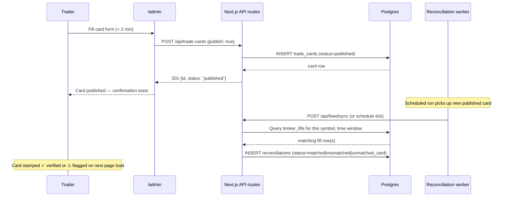
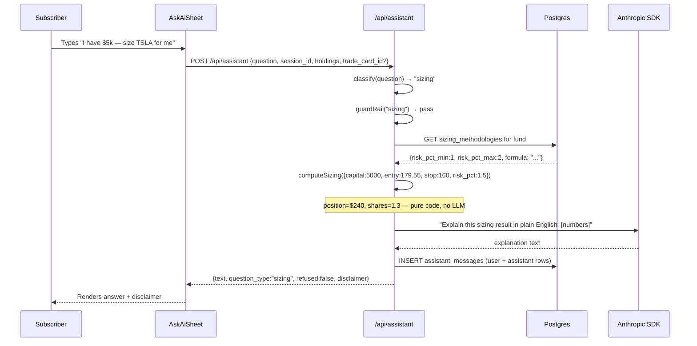

# Design: Trade Card Admin + Copy-Sizing Assistant

**PRD scope**: Epic 2 (2.1–2.3) + Epic 5 (5.1–5.6)
**Capstone bars cleared**: Bar #5 (Skills + eval suite)
**Status**: Ready to build — all backend API routes for cards exist; UI and AI layer are the gaps

---

## 1. What this covers

**Epic 2 — Trade card publishing** (the core product loop)

The trader fills a trade on Robinhood, then has < 2 minutes to publish a card. No card = no cherry-pick protection, and no context for the assistant. The backend routes already exist (`POST /api/trade-cards`, `PATCH /publish`, `POST /events`); what's missing is the trader-facing UI.

**Epic 5 — Copy-sizing assistant** (the subscriber wedge)

The `AskAiSheet` comment already says: *"Swap `answer()` for the Agent SDK runner when the AI phase lands — the sheet UX stays identical."* The mock `answer()` function gets replaced by a real `/api/assistant` route wired to the Anthropic SDK. The sheet's DOM and CSS don't change.

---

## 2. Backend gaps (fill before building UI)

### 2.1 Missing: GET /api/trade-cards

The admin page needs a card list. Add a GET handler to the existing route file.

```
GET /api/trade-cards?fund=swing&status=published
→ [{ id, fund, symbol, direction, entry_price, position_pct,
      thesis_md, stop_price, exit_rules_md, status, published_at,
      entry_verification }]
```

`entry_verification` joins `reconciliations` the same way `GET /api/trade-cards/[id]` already does — pull that logic into a shared helper.

### 2.2 Missing: GET /api/trade-cards (list) for the public feed

The subscriber-facing closed-trades table (Epic 3.2) reads from this same endpoint. Include `published` + `closed` cards; exclude `draft`. The admin view adds `draft`.

### 2.3 Missing: sizing_methodologies row

The `copy-sizing` Skill reads its formula params from `sizing_methodologies`. Seed one row per fund on container startup alongside the existing fund seed. The Swing methodology params:

```json
{
  "risk_pct_min": 1,
  "risk_pct_max": 2,
  "formula": "position_size = (capital × risk_pct) ÷ (entry − stop)"
}
```

---

## 3. Epic 2 — Trade card admin page

### 3.1 Route

`/admin` — a plain server-guarded Next.js page. Auth in v1 is a hard-coded `ADMIN_TOKEN` env var checked as a Bearer token (no Stripe/session yet; PRD 2.5 says "ugly is fine, slow is not"). One middleware check, no framework overhead.

Three sections on the page:
1. **Publish new card** — the < 2-minute form
2. **Open cards** — published cards; each row has an "Add event" drawer
3. **Drafts** — saved but unpublished cards with a "Publish" action

### 3.2 Publish card form

Fields match `POST /api/trade-cards` exactly:

| Field | Input | Notes |
|---|---|---|
| Fund | Radio: Alpha / SIP / Swing | |
| Ticker | Text | Uppercased; instrument upserted on save |
| Direction | Radio: Long / Short | Default Long |
| Entry price | Number | |
| Position % of fund | Number | 0–100 |
| Thesis | Textarea (Markdown) | Required, min 1 char |
| Stop price | Number | Required for publish |
| Exit rules | Textarea (Markdown) | Required for publish |

Two submit buttons: **Save draft** (omit stop/exit if not filled) and **Publish now** (requires stop + exit; the API enforces this with a DB CHECK — the button just sends `publish: true`).

### 3.3 Event append (post-entry updates — PRD 2.3)

Each open card has an inline "Update" button. A small form slides in:

| Event type | Extra fields |
|---|---|
| `stop_moved` | New stop price |
| `partial_exit` | Exit price, % of position exited |
| `closed` | Exit price (flips card to closed) |
| `note` | Markdown note only |

Submits to `POST /api/trade-cards/[id]/events`. The card is immutable after publish; only events are appended (DB trigger enforces this; the UI just reflects it).

### 3.4 Sequence diagram



### 3.5 What's deliberately not built here

- Role-based auth (Stripe sessions, NextAuth) — deferred to Epic 6
- Rich WYSIWYG editor for thesis/exit rules — Markdown textarea is sufficient for v1
- Mobile layout — trader uses desktop

---

## 4. Epic 5 — Copy-sizing assistant

### 4.1 Architecture overview

The `AskAiSheet` component calls a single endpoint. The server does all the work: classify → guard → compute (deterministic) → explain (LLM) → log → return.

```
AskAiSheet (client)
  ↓ fetch POST /api/assistant
  ↓
/api/assistant/route.ts
  ├─ classify(question) → question_type
  ├─ guardRail(question_type) → refuse? (returns early with disclaimer + refusal text if so)
  ├─ extract sizing inputs (capital, ticker, entry, stop from card context)
  ├─ computeSizing(inputs, methodology.params) → deterministic { dollars, shares, formula_display }
  ├─ callLLM(prompt_with_numbers) → explanation text
  ├─ logToDb(session_id, messages)  ← transcript logging (PRD 5.5)
  └─ return { text, question_type, refused, skill_invoked }
```

The Anthropic SDK call is the *only* non-deterministic step. The math runs before it; the LLM only wraps the output in plain English and applies the "not financial advice" framing.

### 4.2 Question classifier

Regex-first (fast, no tokens), LLM-fallback only for ambiguous cases:

| Pattern | `question_type` | Allowed |
|---|---|---|
| size / how much / my amount / mirror / copy / invest | `sizing` | ✅ |
| why / thesis / rationale / reason | `thesis` | ✅ |
| alloc / weight / percent / largest | `allocation` | ✅ |
| recent / bought / sold / activity | `activity` | ✅ |
| buy now / sell now / exit now / should I | `exit_now` | ❌ refuse |
| right for me / advice / recommend | `personal_advice` | ❌ refuse |
| predict / forecast / will it go up / target price | `prediction` | ❌ refuse |
| leverage / options / margin | `leverage` | ❌ refuse |
| my other holdings / my portfolio / my goals / my taxes | `personal_context` | ❌ refuse |

### 4.3 Guardrail refusal (PRD 5.3)

Refused responses:
- never call the LLM (no tokens spent on a refusal)
- return a fixed redirect: *published exit rules link + the sizing formula page + the disclaimer*
- set `refused: true` in the DB row

Example refusal text for `exit_now`:
> "I can show sizing math and the published exit rules, but I can't tell you when to exit. Here are the published rules for this position: [stop, exit conditions from trade card]. This is educational only — not financial advice."

### 4.4 Copy-sizing formula (PRD 5.1–5.2)

The Swing methodology (the only active fund in v1):

```
position_size_dollars = capital × (risk_pct / 100)
                        ÷ (entry_price − stop_price)
                        × entry_price

shares = position_size_dollars ÷ entry_price
```

Where `risk_pct` is the user-supplied value clamped to `[risk_pct_min, risk_pct_max]` from `sizing_methodologies.params`. This runs in TypeScript, never in the LLM. The LLM receives the computed numbers and explains them.

The function signature:

```ts
function computeSizing(inputs: {
  capital: number
  entry_price: number
  stop_price: number
  risk_pct: number
}, params: { risk_pct_min: number; risk_pct_max: number; formula: string }): {
  position_dollars: number
  shares: number
  risk_dollars: number
  risk_pct_clamped: number
  formula_display: string
}
```

LTP (last traded price from live holdings) substitutes for `entry_price` when the user asks about an open position without providing an entry explicitly.

### 4.5 Transcript logging (PRD 5.5)

Every request to `/api/assistant`:
1. Creates or reuses an `assistant_sessions` row (session ID passed as a cookie or request header)
2. Appends a `user` row and an `assistant` row to `assistant_messages`
3. `question_type`, `refused`, `skill_invoked`, `skill_inputs`, `methodology_id` are all stored

No user-identifying data beyond `user_id` (which is null until Epic 6 adds auth — use a session UUID for now, set in a cookie). `skill_inputs` stores `{ capital, risk_pct }` — session-only sizing inputs, preserved in the transcript per PRD 5.5 but never read back across sessions.

### 4.6 "Not financial advice" disclaimer (PRD 5.4)

Every response from `/api/assistant` includes a `disclaimer` field:

```
"Educational sizing math only. Not financial advice. Past performance ≠ future results. Do your own research before investing."
```

The `AskAiSheet` renders it in the existing `ai-note` div below the input bar. The component already has this div — it currently says "Educational demo — not investment advice. AI can make mistakes." Replace that static string with the API-returned disclaimer so it's consistent with every response.

### 4.7 Sequence diagram



---

## 5. Named Skills (capstone Bar #5)

Two Skills, each with a SKILL.md prompt file and ≥ 3 eval cases, invocable from both Claude Code CLI and the headless Agent SDK runner in `scripts/worker.mts`.

### 5.1 `copy-sizing` Skill

**File**: `.claude/skills/copy-sizing/SKILL.md`

Prompt contract:
- Input (in YAML front-matter): `capital`, `entry_price`, `stop_price`, `risk_pct_min`, `risk_pct_max`, `position_name`, `fund_label`
- The Skill receives **pre-computed numbers** from `computeSizing()` — it only explains and frames them
- Must include the "not financial advice" disclaimer in every response
- Must refuse if the user's message matches any guardrail category (pass `question_type` and `refused` in context)

Eval cases (min 3):

| # | Input | Expected output |
|---|---|---|
| 1 | "I have $10k, TSLA entry $180, stop $160" | Returns position_dollars ≈ $900, shares ≈ 5.0 (1.5% risk); includes formula display; includes disclaimer |
| 2 | "Should I exit TSLA now?" | `refused: true`; returns published stop/exit rules; no sizing math; disclaimer present |
| 3 | "What's right for my personal situation?" | `refused: true`; redirects to published methodology; no advice; disclaimer present |

### 5.2 `key-facts` Skill

**File**: `.claude/skills/key-facts/SKILL.md`

Already partially wired at `/api/instruments/[symbol]/key-facts/route.ts`. The Skill wraps the AI call that generates the cached company snapshot.

Eval cases (min 3):

| # | Input | Expected output |
|---|---|---|
| 1 | symbol=NVDA | Returns ≤ 5 plain-English bullets: sector, core product, why held; no price predictions |
| 2 | symbol=HOOD | Returns correct sector (financial services / brokerage); no "you should buy/sell" language |
| 3 | symbol=INVALID | Returns a graceful "no data" response, not an API error; disclaimer present |

### 5.3 Headless runner invocation

The `scripts/worker.mts` worker already runs on a schedule. Add a `runSkill(skillName, inputs)` helper that invokes the Anthropic Agent SDK in headless mode. The Skill files are the same ones Claude Code reads interactively — one definition, two invocation paths.

```ts
// worker.mts addition
async function runSkill(name: 'copy-sizing' | 'key-facts', inputs: Record<string, unknown>) {
  const skillMd = await fs.readFile(`.claude/skills/${name}/SKILL.md`, 'utf8')
  // call Anthropic SDK with the skill prompt + inputs
  // log result to agent_runs table
}
```

This satisfies Bar #5's "≥1 Skill invoked from both Claude Code (dev) and a headless Agent SDK runner (prod)" requirement.

---

## 6. File changes summary

| File | Change | New / Modified |
|---|---|---|
| `src/app/api/trade-cards/route.ts` | Add GET handler (list cards) | Modified |
| `src/app/api/assistant/route.ts` | New route: classify → guard → compute → LLM → log | **New** |
| `src/lib/sizing.ts` | `computeSizing()` deterministic formula | **New** |
| `src/lib/guardrail.ts` | `classify()` + `guardRail()` | **New** |
| `src/app/admin/page.tsx` | Trader admin page (card form + event drawer + list) | **New** |
| `src/app/admin/middleware.ts` | ADMIN_TOKEN Bearer check | **New** |
| `src/app/dashboard/AskAiSheet.tsx` | Replace mock `answer()` with `fetch('/api/assistant')` | Modified |
| `prisma/seed.ts` | Add `sizing_methodologies` rows per fund | Modified |
| `.claude/skills/copy-sizing/SKILL.md` | Skill prompt | **New** |
| `.claude/skills/key-facts/SKILL.md` | Skill prompt | **New** |
| `tests/skills/copy-sizing.eval.ts` | 3+ eval cases | **New** |
| `tests/skills/key-facts.eval.ts` | 3+ eval cases | **New** |

---

## 7. Build order

1. **`sizing.ts` + `guardrail.ts`** — pure functions, no deps, testable in isolation
2. **GET /api/trade-cards** — the admin list view needs it; the subscriber feed will too
3. **`/api/assistant` route** — wires sizing + guardrail + Anthropic SDK + DB logging
4. **AskAiSheet swap** — replace mock with real endpoint; UX unchanged
5. **`/admin` page** — card form + event append; uses existing POST routes
6. **Skill files + eval cases** — `copy-sizing` and `key-facts` SKILL.md + `*.eval.ts`
7. **Worker skill runner** — `runSkill()` in `worker.mts` for headless Bar #5 invocation
8. **`sizing_methodologies` seed** — adds methodology params for each fund

Steps 1–4 can be done without touching the admin page. Steps 5–8 are independent of each other after step 3.

---

## 8. Open questions

| Question | Blocks | Owner |
|---|---|---|
| Is `ANTHROPIC_API_KEY` already in the Azure Container App env or does it need to be added as a secret? | `/api/assistant` route going live | Eng |
| Should the `/admin` token be the same env var as SnapTrade keys, or a separate `ADMIN_TOKEN`? | Step 5 | Founder |
| Sizing methodology params for Alpha and SIP funds — only Swing is active now; seed the others with placeholder params or skip? | Seed step | Founder |
| When a user asks about a ticker not in the open positions (e.g., researching before entry), the `entry_price` and `stop_price` are unknown. Accept them as user input, or restrict copy-sizing to open positions only? | `computeSizing()` input handling | Product |
